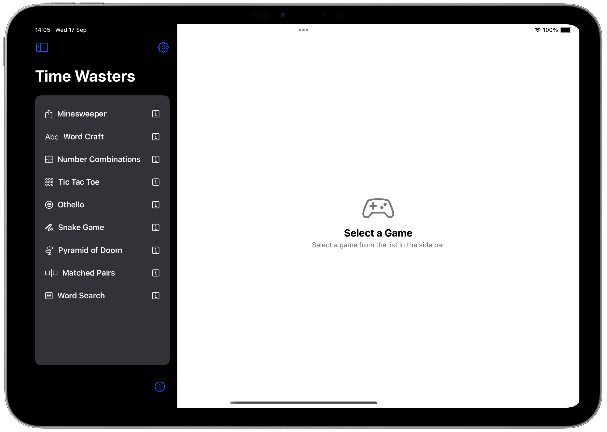
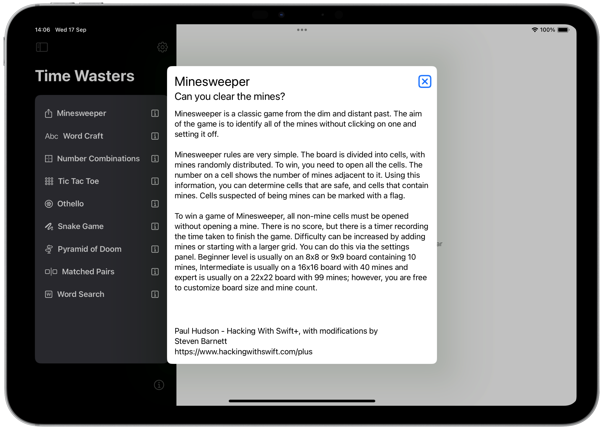

# A Time Wasters Compendium
A while ago, I wrote  A Time Wasters Compendium for the Mac. It was my first attempt at writing games, albeit simple retro low-graphics games. I completed the project and, for a short while, I even played some of the games I had written. The problem was, I had written then for the Mac (that was the aim) and I couldn't be bothered to fire up the Mac to play the games.

So, this project has born. I have an iPad and I have some Mac games; how difficult could it be to port them across and play them in the iPad? Easy, huh? 

This project is/was my attempt to port the games. And, yes, it turned out to be a lot easier than I was expecting. The Mac games had been created as xcFrameworks, so the game source code was isolated. The game front end was Mac specific, so would need a re-write but creating a simple front end on the iPad is fairly trivial.

Welcome to Time Wasters for the iPad. Oh, and, for good measure, it also runs on the Mac.

### What's included

At present, this Mac app contains nine games;

* Minesweeper
* WordCraft
* Snake
* Pyramid of Doom
* Number Combinations
* Tic Tac Toe
* Othello
* Matched Pairs
* Word Search

These are a mixture of games I have adapted and games I have written myself. 

* Minesweeper and WordCraft were created by [Paul Hudson in his Hacking with Swift+ live streams]( https://www.hackingwithswift.com/plus ). I have 'messed' with them to extend the games. 

* Snake, Number Combinations, Tic Tac Toe, Othello, Matched Pairs and Word Search are mine. I've picked up the basic logic from web articles but have written the code myself.

* Pyramid of Doom is a Stott Adams game from way back when the TRS-80 was still cool - this is my port of that game, taken from the original C code and ported to Swift. I then added a SwiftUI front end as the original game was a console line game.

More will be added at some point, as and when I come across something I like the look of.

### Current State

Currently, the conversion process has been completed and all games are playable. However, there are lots of tweaks that I need to go to polish the games properly for the iPad layout. Many of the games were fixed size on the Mac so cells could be of a pre-dedtermined size. Some of these didn't work well on the iPad so I'mm reviewing all games to make sure the layouts work better. When this process is complete, I'll be flagging that here.

### The Games

The opening screen is considerable simpler than the Mac version; presenting a list of available games for the player to pick from.

If you click on one of the buttons, the game will open.

The entire project has been converted for Swift 6 compatability. 

## Minesweeper

Minesweeper is the classic game from the early days of computing. You are presented with a grid of buttons that hide a number of mines. Your job is to click on a square to clear it without clicking on any of the mines. The game ends when you have identified all of the mines and have cleared all of the non-mine cells.

The conversion of this game from the Mac version was pretty straight forward to begin with. The game converted and ran after very minor changes. However, it was not optimised for the iPad. Once the game was working, I had to adjust the view to resize itself to the available space and to implement a proper toolbar. 

## WordCraft

Wordcraft is, on the face of it, a simple game. It can, however, be frustratingly difficult. You are given a grid of letters from which you select letters to create words. The twist is that you have to comply with a rule for each word. That may be something as simple as the word has to start with a specific letter or the word has to have an even or odd number of letters.

You also cannot use the same word twice!

04-Dec-2024: Since the original development, I have increased the work count from around 60,000 words to over 102,000 words, giving you a getter chance to match a word. It would be very difficult to create a complete word list for all english words, so the 102,000 count is a compromise.

## Snake

This is a very old, low res, style of game where you have to move the snake around the board. Your objective is to grow the snake by eating food. Starts out easy, but becomes increasingly complicated as the snake grows. You must remain within the game board and you cannot cross the snake body. If you run into the snake body, you lose the game.

This game proved a bit of a headache to convert. The Mac version was driven by the keyboard and that just wasn't possible on the iPad. The solution was to produce the game play buttons to allow you to change the direction of the snake and to play/pause the game.

## Pyramid of Doom

Decades ago, when I was coding in Z80 assembler on the TRS-80, Scott Adams created some text adventure games. None of your fancy graphics here - you type commands, they get interpreted and the console updates with the results. The original code was written in C and has been stable for a very long time. As far as I know, nothing has happened to it in all that time. 

This is my variant, written in Swift/SwiftUI. It took a long time to translate the original C code to Swift and a lot of debugging to makwe sure I was loading the original game files correctly. The result is Pyramid of Doom:

This game me some headaches to convert. The code copied over and ran first time. Problem is, the Mac variant uses a text box so half of the screen disappeared under the keyboard. I tried several ways to fix this and, in the end, I coded my own, more compact, keyboard that just contained the elements i needed.

## Number Combinations

Number Combinations is a pretty straight forward game. Given four numbers and a result, work out the formula you need to generate the result. you must use all four digits and you can use + - * or / operators to achieve the result. You can force the order of calculation using brackets if you need to.

There is an option to display the formula if you're really stuck. 

The main failing of the game at the moment is that divisions are integer divisions so, dividing 3 by 2 results in 1. This isn't ideal and can be used to solve most formulae. I want to address this at some point, but it's not a priority right now.

## Tic Tac Toe

Better known to some of us oldies as 'Noughts and Crosses', Tic-Tac-Toe is a classic game that has been played for centuries. It is a simple game that can be played by two people or, in our case, one player against a a fiendish computer.

The game is played on a 3x3 grid, and each player takes turns placing their mark in a square. The player who gets three in a row horizontally, vertically, or diagonally wins the game.

The game is simple, but quite hard to win against the AI built into the computer. Can you beat the computer?"

This is a relatively simple game, but includes an AI that calculates the computers move. This is a simplease but very effective AI that leaves just enough space to allow the player to occasionally win. Draw's tend to be the usual result.

Scores are saved across invocations of the app, but can be reset using the reset icon on the tool bar.

## Othello

Othello is a strategy board game for two players (you and the computer), played on an 8 by 8 board. The game traditionally begins with four discs placed in the middle of the board. The computer will randomly select who goes first. The player always plays black and the computer white. There is no advantage to the colour of the pieces.

You must place a disc on the board, in such a way that there is at least one straight (horizontal, vertical, or diagonal) occupied line between the new disc and another of your discs, with one or more contiguous computer pieces between them.

After placing the disc, the opposition discs flip lying on a straight line between the new disc and any existing discs. All flipped discs are now yours. Now the computer plays. This computer operates under the same rules, with the roles reversed: it lays down a disc, causing your discs to flip.

Where there are no moves available, you or the computer skips their move and control reverts to the other player. The game ends when the board is full or neither player can move. At this time, the winner is determined by who has the most face up discs.

The game is deceptively simple to play but quite hard to win at. The computer will favour capturing corners where it can and will go for the highest scoring move after that. It's not a perfect algorithm, but it makes for a difficult game but not an unbeatable one. No one wants a game where they always lose.

## Matched Pairs

I have logic games, numerical games and word game, so it seemed about time I had a memory game. Matched Pairs is it.

The premise of the game is simple. You are presented with a grid of face down playing cards and your job is to match pairs of cards. Click ona card and it turns face up. Click a second card and that turns face up too. If they match, the cards are removed from the game. If they don't match, they remain face up until you click a third card. At that point, the previous two turn face down. 

All you have to do is remember what card was where in the grid.

As an added fun factor, the game can be configured such that the cards will automatically be turned face down after a set time (between 2 and 20 seconds). There are also easy, medium and hard levels where the number of cards changes, so testing your memory.

There is a leader board for all three levels which is based on the time it takes to match all of the cards.

## Word Search

I've always been fascinated by word search games so it's only logical that I get one into the compendium. This game presents a 14x14 grid of letters and 14 words to find. The words are between 3 and 12 letters long and may appear in the grid horizontally, vertically or diagonally. Just to add to the fun they may also be presented backwards.

The player identifies a word by clicking on the first and last letter. Assuming the word selected matches one of the words to be found, it will be highlighted on the game board and in the list. All words will exist somewhere on the grid.

The time taken to find all the words will be recorded and used to maintain a leader board of the five fastest times.

The game supports three levels of play:

* Easy - where words are arranged left to right or top to bottom,
* Medium - where words are left to right, right to left, top to bottom or bottom to top,
* Hard - where words are arranged in all vertical, horizontal or diagonal directions.

Recognising that this can be a difficult game to complete, there is also a hint mode where the player can type a single letter on the keyboard and all occurrences of that letter will be highlighted. So as to not make the game too easy, they are only highlighted for 2 seconds and it incurs a 10 second penalty on your score. 

## Overviews

When you hover over the buttons on the home screen, the clock face will change to an information icon. If you click the information icon, you get an overview of the game.

While playing a game, you can get game play instructions by clicking the question mark icon.

